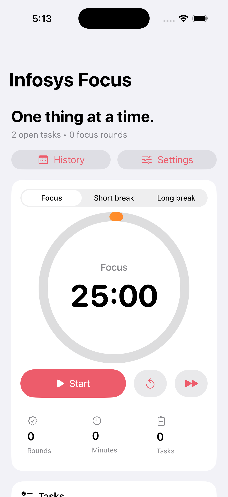

# Infosys Focus

Infosys Focus is a small SwiftUI productivity app built around three things that help during study or work blocks:

- a Pomodoro timer
- a simple task list
- light ambient sound for focus

The app is intentionally simple. It does not require a backend, account, or paid API. Tasks are saved locally on the device and the ambient sounds are generated in-app, so the repository stays lightweight.

## Screenshots

<p>
  
  
</p>

## Features

- Pomodoro timer with focus, short break, and long break modes
- Custom timer durations saved locally
- Start, pause, reset, and skip controls
- Local notifications when a Pomodoro session ends
- Local task list with add, complete, delete, and clear completed actions
- Task persistence using `UserDefaults`
- Persisted focus stats for completed rounds and total focus minutes
- Focus history screen with daily summaries and recent sessions
- Ambient sound options for rain, ocean, and deep noise
- Home Screen widget for current timer state and focus stats
- Custom app icon
- Native SwiftUI interface for iPhone and iPad

## Tech Stack

- Swift
- SwiftUI
- AVFoundation
- Xcode 26.2
- iOS 17+

## Project Structure

```text
InfosysFocus/
  Models/
    FocusSession.swift
    FocusTask.swift
  Services/
    AmbientAudioController.swift
    NotificationScheduler.swift
    TaskStore.swift
  Shared/
    SharedFocusState.swift
  ViewModels/
    PomodoroViewModel.swift
  Views/
    AmbientPickerView.swift
    ContentView.swift
    FocusHistoryView.swift
    TaskListView.swift
    TimerSettingsView.swift
    TimerRingView.swift
InfosysFocusWidget/
  InfosysFocusWidget.swift
```

## Running the App

1. Open `InfosysFocus.xcodeproj` in Xcode.
2. Select the `InfosysFocus` scheme.
3. Choose an iPhone simulator or a connected iPhone.
4. Press Run.

You can also verify from the terminal:

```sh
xcodebuild -project InfosysFocus.xcodeproj -scheme InfosysFocus -sdk iphonesimulator -destination 'generic/platform=iOS Simulator' build CODE_SIGNING_ALLOWED=NO
```

## Notes

- No third-party packages are used.
- Ambient audio is generated with `AVAudioEngine`; there are no bundled music files.
- The app stores data only on the device.
- The widget shares timer state through the App Group `group.com.arnav.infosysfocus`.
- For a real iPhone build, select your Apple Developer Team in Xcode and enable the same App Group for both the app target and widget extension.
